# Milestone M8: Buyer Discovery + Contact Enrichment + Dashboard Providers Architecture

**Status:** FROZEN ARCHITECTURE SPECIFICATION (Step 0)
**Milestone:** M8
**Canonical Base Commit:** `f4d6c5b1e749f5d07c1437654d868e2f3774cc27`
**Target Milestone Closure:** M8 Step 14

---

## 1. Executive Summary & Primary Product Goal

LeadAtlas enables B2B sales teams and business owners to find relevant commercial buyers for their products and services, obtain legitimate public business contact information, analyze buyer needs and purchasing intent, manage qualified opportunities on a unified customer page, generate AI-tailored offers with mandatory human oversight, run structured multi-channel campaigns, and track conversions through to closed business.

### End-to-End Value Stream

```mermaid
flowchart LR
    A["1. Product / Service Spec"] --> B["2. Targeted Buyer Search"]
    B --> C["3. Customer Discovery (Free-First)"]
    C --> D["4. Public Contact Enrichment"]
    D --> E["5. Need & Intent Analysis"]
    E --> F["6. Customer Data Page (/customers)"]
    F --> G["7. AI Offer Draft (M5)"]
    G --> H["8. Human Approval & Campaign Dispatch (M6)"]
    H --> I["9. Follow-Up & Opportunity (M3)"]
    I --> J["10. Confirmed Customer Order"]
```


---

## 2. Core Safety, Privacy & Contact Invariants

### 2.1 Private Search History Boundary (Strict Anti-Surveillance Rule)
* **The Rule:** LeadAtlas **NEVER** claims, implies, or attempts to discover private individuals based on personal search history or private web queries.
* **What We Discover:** Public business entities, publicly posted Requests for Quotation (RFQs), official procurement notices, public business directories, commercial listings, and public company pages.
* **What We Cannot Discover:** No system can legitimately reveal the personal phone, home address, or identity of a private individual merely because they privately typed a keyword into a search engine. LeadAtlas strictly adheres to this ethical and legal reality.

### 2.2 The Contact Safety Invariants
1. **`PHONE != WHATSAPP`:**
   * A phone number is recorded as `ContactType.PHONE` only.
   * Under no circumstances is WhatsApp status inferred from a Bangladesh mobile prefix (`+8801...`).
   * WhatsApp status is only set to `CONFIRMED` or `PUBLICLY_LISTED` if verified from an explicit public business link (e.g., `wa.me/` widget or explicit "WhatsApp: +880..." label on the official business page).
2. **Zero Fabrication:**
   * Never guess emails (no fabricated `@gmail.com` or syntax extrapolation).
   * Never guess addresses or websites.
   * Missing attributes remain strictly `null`/empty.
3. **Immutable Provenance:**
   * Every contact item and intent signal must retain origin metadata (`sourceName`, `sourceUrl`, `evidenceType`, `discoveredAt`, `lastCheckedAt`).

---

## 3. Free-First Provider Strategy & Source Matrix

LeadAtlas prioritizes low-cost, open, and legally compliant sources before consuming fee-based quotas.

### Provider Priority Ladder
1. **Existing LeadAtlas Repository Data:** Local CRM database matching and deduplication.
2. **OpenStreetMap / Overpass API:** Open-data business discovery, addresses, coordinates, and public tags.
3. **Official Business Websites:** SSRF-safe direct public inspection of business contact/about pages.
4. **Public Allowed Business Directories:** Trade associations, chamber directories, and public trade registries.
5. **Public RFQ & Procurement Portals:** Public government and institutional procurement notices (e.g., e-GP Bangladesh).
6. **Public Marketplaces & Buying Requests:** Permitted public B2B commercial listing signals.
7. **Google Places API (New) (Optional Paid):** Bounded discovery, basic verification, place IDs, and address resolution.

### Provider Comparison Matrix
| Source | Cost | Bangladesh Coverage | Phone Availability | WhatsApp Availability | Address Availability | Email Availability | Terms & Risk Profile |
| :--- | :--- | :--- | :--- | :--- | :--- | :--- | :--- |
| **OpenStreetMap (Overpass)** | Free ($0) | High (Urban BD) | Moderate | Rare | High | Rare | ODbL license, requires attribution; safe open data; respectful rate limits. |
| **Official Websites (Direct)** | Free ($0) | High (Commercial) | Very High | High (via `wa.me`) | High | High | Existing SSRF guard (IP pinning, DNS preflight) + planned M8 contact extractor (robots.txt compliance, 10s timeout, 2MB cap); zero auth bypass. |
| **Public Procurement (e-GP)** | Free ($0) | Complete (Gov/Corp) | High (Officers) | Low | High | High (Tender contacts) | Public domain procurement notices; polite caching; structured RFQ intent. |
| **Public Trade Directories** | Free ($0) | Moderate (DCCI/FBCCI) | High | Moderate | High | Moderate | Respect terms of service; no login bypass; no CAPTCHA defeating. |
| **Google Places API (New)** | Paid (Optional/Usage-based) | Very High | High | Low (Phone only) | Very High | Zero | Commercial API key; strictly server-side; cost control required. |


---

## 4. Google Places API (New) Optional Role & Cost Control

### 4.1 Bounded Role
* Google Places is strictly **optional** and secondary to free providers.
* Used primarily for: business discovery, verified address, official website, public phone, category, and Place ID provenance.
* Not used to claim private buyer intent.

### 4.2 Architectural Cost-Control Safeguards
1. **Strict Field Masks:**
   * Discovery queries (`places:searchText`) must use `X-Goog-FieldMask` containing only:
     `places.id,places.displayName,places.formattedAddress,places.nationalPhoneNumber,places.internationalPhoneNumber,places.websiteUri,places.rating,places.userRatingCount,places.primaryType,places.types`.
   * **Prohibited during initial search:** `reviews`, `photos`, `atmosphere`, `priceLevel` to avoid highest tier billing.
2. **Bounded Pagination:**
   * Default search page size: `10` (max limit `20`).
   * No auto-fetching of subsequent pages without explicit user pagination.
3. **Two-Stage Enrichment:**
   * Stage 1: Search & basic preview (returns candidate summaries).
   * Stage 2: Detail enrichment occurs only when user explicitly saves or inspects a selected high-value lead.
4. **Tenant Daily Quota Limits:**
   * Configurable daily per-organization request budget stored in `DataSourceConfig.settings`.
   * Hard stop when organization reaches quota; clear user feedback in UI.
5. **Estimation Pre-Flight:**
   * Bulk actions show estimated request counts before execution.

---

## 5. Dashboard Credential Management Architecture

To eliminate manual `.env` file editing, credentials are managed directly from the dashboard by authorized administrators.

```mermaid
sequenceDiagram
    participant Admin as Admin Browser
    participant API as LeadAtlas Backend API
    participant DB as PostgreSQL (data_source_configs)
    participant Provider as External Provider (Google Places)

    Admin->>API: POST /api/v1/settings/data-sources/google-places/configure { apiKey } (HTTPS)
    Note over API: Authenticate user & verify DATASOURCES_MANAGE permission
    Note over API: Derive 32-byte key from CREDENTIAL_ENCRYPTION_KEY
    Note over API: Encrypt apiKey with AES-256-GCM (12-byte random IV)
    Note over API: Compute masked credential (e.g. AIza••••••••••••••9x2A)
    API->>DB: Upsert DataSourceConfig (encryptedCredential, credentialMasked, isActive)
    API->>DB: Write AuditLog (action: datasource.configured; NO SECRET)
    API-->>Admin: Return { success: true, credentialMasked: "AIza••••9x2A" }

    Note over Admin,API: Later: Server-side search execution
    Admin->>API: POST /api/v1/business-search/query { q, location }
    API->>DB: Query active DataSourceConfig for tenant
    Note over API: Decrypt encryptedCredential in memory using AES-256-GCM
    API->>Provider: POST https://places.googleapis.com/v1/places:searchText (Server-Side)
    Provider-->>API: Places JSON response
    Note over API: Normalize results (PHONE != WHATSAPP)
    API-->>Admin: Normalized Business Search Results
```

### Security Guarantees:
* **AES-256-GCM Authenticated Encryption:** Payload format: `iv:authTag:ciphertext` (base64).
* **Zero Client Exposure:** Decrypted keys are never returned in GET endpoints, logs, or AuditLogs.
* **Password Inputs:** Dashboard form fields use `type="password"`.
* **Zero Client Persistence:** Keys are never stored in `localStorage`, `sessionStorage`, URL params, or browser caches.

---

## 6. RBAC & Authority Matrix

LeadAtlas enforces role-based access control based on the frozen permissions model:

| Role | View Masked Data Sources | Configure Credentials | Test Connection | Activate / Disable | Buyer Search & Enrich | Generate AI Offer |
| :--- | :---: | :---: | :---: | :---: | :---: | :---: |
| **SUPER_ADMIN** | Yes | Yes | Yes | Yes | Yes | Yes |
| **ADMIN** | Yes | Yes | Yes | Yes | Yes | Yes |
| **SALES_MANAGER** | Yes (Read-only) | No (HTTP 403) | No (HTTP 403) | No (HTTP 403) | Yes | Yes |
| **SALES_EXECUTIVE** | No (Hidden) | No (HTTP 403) | No (HTTP 403) | No (HTTP 403) | Yes (Assigned) | Yes (Assigned) |
| **VIEWER** | No (Hidden) | No (HTTP 403) | No (HTTP 403) | No (HTTP 403) | Yes (Read-only) | No (HTTP 403) |

* Reuses `Permissions.DATASOURCES_MANAGE: 'datasources:manage'` for all mutation endpoints.
* Zero changes required to the frozen RBAC permission lists.

---

## 7. Customer Data Page & Opportunity Domain Design

### 7.1 Unified Customer Page (`/customers`)
The Customer Data page is the operational workspace connecting discovery with the sales pipeline.

#### Core Customer / Opportunity Record Attributes:
* **Identity:** Contact Name, Business Name, Normalized Name.
* **Direct Contacts:** Primary Phone (E.164), WhatsApp Status (`UNKNOWN`, `PUBLICLY_LISTED`, `CONFIRMED`), Email, Business Address, City, Country (`BD`).
* **Online Presence:** Website, Facebook / Public Business Page URL, Website Reachability.
* **Buyer Profile:** Customer Type (`RETAILER`, `WHOLESALER`, `DISTRIBUTOR`, `ECOMMERCE_SELLER`, `CORPORATE_BUYER`, `UNKNOWN`).
* **Purchasing Intent:**
  * **Need:** Structured explanation of what the buyer likely needs and why.
  * **Product Interest:** Target product category (e.g., `Smart Watch`, `Rechargeable Fan`).
  * **Intent Score:** Deterministic integer score (0–100).
  * **Intent Evidence:** Supporting source signal, tender reference, or catalog gap.
* **Pipeline Status:**
  * **Source & Provenance:** Primary Source, Source URL, Last Checked Date.
  * **Campaign Status:** `NOT_ADDED`, `IN_CAMPAIGN`, `OUTREACH_PENDING`, `CONTACTED`, `RESPONDED`.
  * **Opportunity Status:** Maps to `CrmStage` (`NEW`, `CONTACTED`, `QUALIFIED`, `PROPOSAL_SENT`, `NEGOTIATION`, `WON`, `LOST`).

#### Actions on Customer Data Page:
1. `View Details`: Comprehensive drawer/modal with contact provenance and intent audit trail.
2. `Enrich Contacts`: Trigger website or public directory lookup for additional verified contacts.
3. `Save to CRM`: Confirm lead into CRM database.
4. `Generate AI Offer`: Direct transition to M5 AI Sales Assistant.
5. `Add to Campaign`: Batch qualification into targeted outreach campaign.

---

## 8. Need Field & Intent Evidence Engine

### 8.1 Definition of "Need"
"Need" is a factual, evidence-backed description of the buyer's product/service requirement.

### 8.2 Need Construction Examples:
| Buyer Type | Discovery Signal | Need Statement | Required Intent Evidence |
| :--- | :--- | :--- | :--- |
| **Retailer** | Electronics store with phone cases/chargers but no smartwatches in catalog | *Smart Watch wholesale stock for retail showcase* | Catalog gap analysis from official Facebook page; active retail location in Bashundhara City. |
| **Wholesaler** | Mitford/Chawkbazar trade distributor advertising electronics | *Smart Watch bulk import / distributor pricing* | Public wholesale trade listing; trade license category: Electronics Importer. |
| **Corporate Buyer** | Tender notice on e-GP portal | *Corporate gift order (500 units)* | e-GP Tender Ref #2026-ICT-44; submission deadline 2026-11-15. |
| **E-Commerce Seller** | Active Daraz/Facebook storefront selling fashion accessories | *Fast-moving consumer electronics inventory* | Live social commerce store with >10k followers; active checkout link. |

---

## 9. Campaign Flow & AI Offer Pipeline

### 9.1 Campaign Lifecycle
```
Qualified Customer Records
       │
       ▼
[Add to Campaign] ──► Select Campaign (Product, Target Audience, Channel Strategy)
       │
       ▼
[AI Offer Generation (M5)] ──► Drafts Generated: WhatsApp / Email / Call Script
       │
       ▼
[Human Review & Approval] ──► status: DRAFT -> APPROVED (Mandatory Gate)
       │
       ▼
[Outreach Delivery (M6)] ──► Two-Gate Suppression Defense -> Dispatch
       │
       ▼
[Follow-Up Tracking (M3)] ──► Auto-scheduled tasks & CRM stage progression
```

### 9.2 Critical Constraints:
* Discovered leads are **never** auto-contacted without explicit human review and approval.
* Potential buyer != Confirmed order. Orders are recorded only after formal commercial agreement.

---

## 10. Data Model Extensions (Roadmap Planning)

## 10. Data Model Verification & Evolution (Roadmap Planning)

### 10.1 Existing Schema State vs. Proposed M8 Extensions

#### A. DataSourceConfig Model
* **Current Exact Model (`packages/db/prisma/schema.prisma`):**
  - Fields: `id` (UUID), `name` (String, unique), `role` (`DataSourceRole`, default `BOTH`), `status` (`DataSourceStatus`, default `PENDING`), `isEnabled` (Boolean, default `false`), `termsUrl` (String?), `termsVerifiedAt` (DateTime?), `termsVerifiedBy` (String?), `persistencePolicy` (Json), `refreshPolicy` (Json), `rateLimitConfig` (Json), `pricing` (Json), `createdAt` (DateTime), `updatedAt` (DateTime).
  - Current Constraints: Globally unique `name`.
  - **Does NOT contain:** `organizationId`, tenant relations, `encryptedCredential`, `credentialMasked`, `credentialLastFour`, `costType`, or `isActive` (has `isEnabled`).
* **Proposed M8 Extensions:**
  - Add `organizationId String` with cascade relation to `Organization` (enforcing strict tenant isolation).
  - Transition unique constraint from global `@unique name` to tenant-scoped `@@unique([organizationId, provider])`.
  - Add `costType DataSourceCostType @default(FREE)`.
  - Add `encryptedCredential String?`, `credentialMasked String?`, `credentialLastFour String?`.
  - Add `lastTestedAt DateTime?`.
  - Reuse existing `isEnabled` as the provider activation switch (or add `isActive`).

#### B. LeadContact & ContactEvidence Models
* **Current Exact Models:**
  - `LeadContact`: `id`, `leadId`, `type` (`ContactType`: `PHONE`, `WHATSAPP`, `EMAIL`), `rawValue`, `normalizedValue`, `phoneType` (`PhoneType`: `MOBILE`, `LANDLINE`, `UNKNOWN`), `status` (`ContactStatus`: `FOUND`, `INVALID_FORMAT`, `VERIFIED`, `STALE`), `whatsappStatus` (`WhatsAppStatus`: `UNKNOWN`, `PUBLICLY_LISTED`, `CONFIRMED`), `isPrimary` (Boolean), `createdAt`, `updatedAt`.
  - `ContactEvidence`: `id`, `contactId`, `sourceName` (String), `sourceUrl` (String?), `evidenceType` (`EvidenceType`: `WA_ME_LINK`, `LISTING_FIELD`, `OFFICIAL_PAGE_TEXT`, `AUTHORIZED_API`, `MANUAL_CONFIRMED`), `snippet` (String?), `discoveredAt` (DateTime).
* **Proposed M8 Contact Additions:**
  - `confidence SignalConfidence @default(MEDIUM)` on `ContactEvidence` (**PROPOSED M8 ADDITION** - does not currently exist).
  - `lastCheckedAt DateTime?` on `LeadContact` (**PROPOSED M8 ADDITION** - does not currently exist; currently tracked via `updatedAt` / `discoveredAt`).

#### C. Proposed Opportunity & Intent Signal Entities (Linked to Lead)
```prisma
model Opportunity {
  id              String            @id @default(uuid())
  organizationId  String            @map("organization_id")
  leadId          String            @map("lead_id")
  productInterest String            @map("product_interest")
  buyerType       BuyerType         @default(UNKNOWN) @map("buyer_type")
  need            String
  intentScore     Int               @default(0) @map("intent_score")
  strongestSignal String?           @map("strongest_signal")
  campaignStatus  CampaignStatus    @default(NOT_ADDED) @map("campaign_status")
  createdAt       DateTime          @default(now()) @map("created_at")
  updatedAt       DateTime          @updatedAt @map("updated_at")

  organization    Organization      @relation(fields: [organizationId], references: [id], onDelete: Cascade)
  lead            Lead              @relation(fields: [leadId, organizationId], references: [id, organizationId], onDelete: Cascade)
  signals         BuyerIntentSignal[]

  @@unique([id, organizationId])
  @@index([organizationId, leadId])
  @@index([organizationId, buyerType])
  @@index([organizationId, intentScore])
  @@map("opportunities")
}

model BuyerIntentSignal {
  id             String           @id @default(uuid())
  organizationId String           @map("organization_id")
  opportunityId  String           @map("opportunity_id")
  sourceName     String           @map("source_name")
  signalType     IntentSignalType
  snippet        String?
  sourceUrl      String?          @map("source_url")
  confidence     SignalConfidence @default(MEDIUM)
  detectedAt     DateTime         @default(now()) @map("detected_at")

  opportunity    Opportunity      @relation(fields: [opportunityId], references: [id], onDelete: Cascade)

  @@index([opportunityId])
  @@map("buyer_intent_signals")
}
```


---

## 11. Milestone M8 Execution Roadmap (Steps 0–14)

* **Step 0:** Architecture, Scope Freeze & Free-First Strategy (Current).
* **Step 1:** Shared Contracts, Enums & Buyer Discovery Schemas.
* **Step 2:** Database Schema Migration (Tenant `DataSourceConfig`, `Opportunity`, `BuyerIntentSignal`).
* **Step 3:** Pluggable Provider Registry Refactor & AES-256-GCM Credential Storage Engine.
* **Step 4:** OpenStreetMap / Overpass Free Discovery Provider.
* **Step 5:** Contact Enrichment Provider Abstraction & Multi-Source Provenance.
* **Step 6:** Public Website Contact & WhatsApp (`wa.me`) Safe Inspection Engine.
* **Step 7:** Buyer Need & Deterministic Intent Scoring Domain Service.
* **Step 8:** Customer Data & Opportunities Workspace UI (`/customers`).
* **Step 9:** CRM Pipeline & Follow-Up Task Integration.
* **Step 10:** Campaign Orchestration & M5 AI Offer Integration.
* **Step 11:** Optional Google Places Provider & Dashboard Settings UI (`/settings/data-sources`).
* **Step 12:** Tenant Isolation, Cost Quotas & Rate-Limiting Hardening.
* **Step 13:** Full E2E Integration Suite & Workspace Regression Testing.
* **Step 14:** Final Milestone Review, Documentation & M8 Closure.
